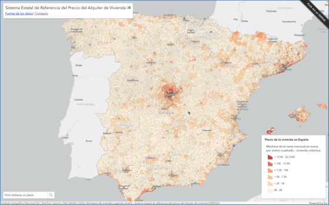

# Sistema Estatal de Referencia del Precio del Alquiler de Vivienda 💶

**Demo:** Abre el visor para [explorar los datos](https://hhkaos.github.io/visor-sistema-estatal-de-referencia-del-precio-del-alquiler-de-vivienda)

**Fuente de [capa de datos](https://www.arcgis.com/home/item.html?id=cdda9092a8d74bcdb76c32b3904d84d3)**:  Ministerio de vivienda y agenda urbana de España

